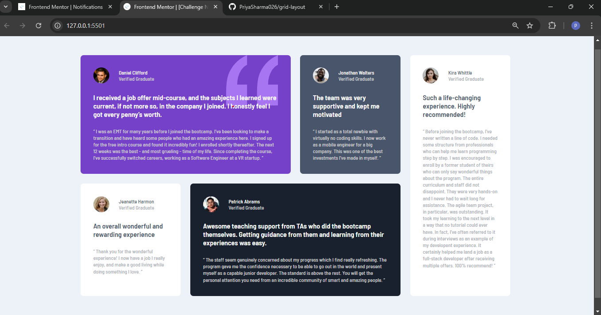

# Frontend Mentor - Testimonials grid section solution

This is a solution to the [Testimonials grid section challenge on Frontend Mentor](https://www.frontendmentor.io/challenges/testimonials-grid-section-Nnw6J7Un7). Frontend Mentor challenges help you improve your coding skills by building realistic projects. 

## Table of contents

- [Overview](#overview)
  - [The challenge](#the-challenge)
  - [Screenshot](#screenshot)
  - [Links](#links)
- [My process](#my-process)
  - [Built with](#built-with)
  - [What I learned](#what-i-learned)
- [Author](#author)  

## Overview

It is a responsive layout using grid.

### The challenge

Users should be able to:

- View the optimal layout for the site depending on their device's screen size

### Screenshot

### Links

- Solution URL: (https://github.com/PriyaSharma026/grid-layout)
- Live Site URL: (https://priyasharma026.github.io/grid-layout/)

## My process

I have used the mobile-first approach designed the single column layout first and then using grid layout I have designed it for desktop size.

### Built with

- Semantic HTML5 markup
- CSS custom properties
- Flexbox
- CSS Grid
- Mobile-first workflow

### What I learned

By doing this project I strengthen my knowledge of grid layout.

## Author

- Frontend Mentor - [@PriyaSharma026](https://www.frontendmentor.io/profile/PriyaSharma026)
-LinkedIn - [Priya Sharma](https://www.linkedin.com/in/priya-sharma26)

